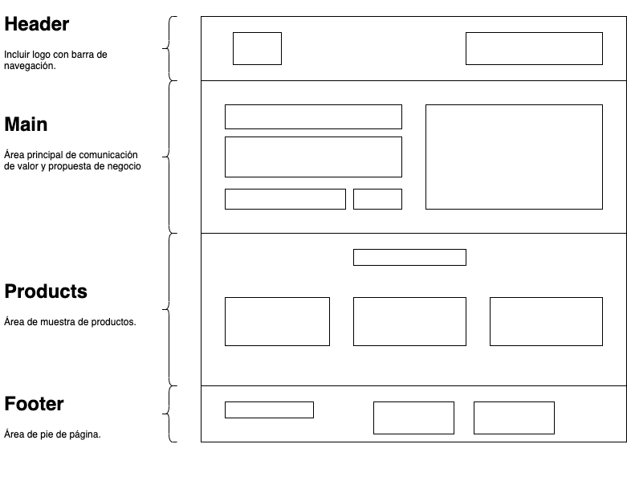
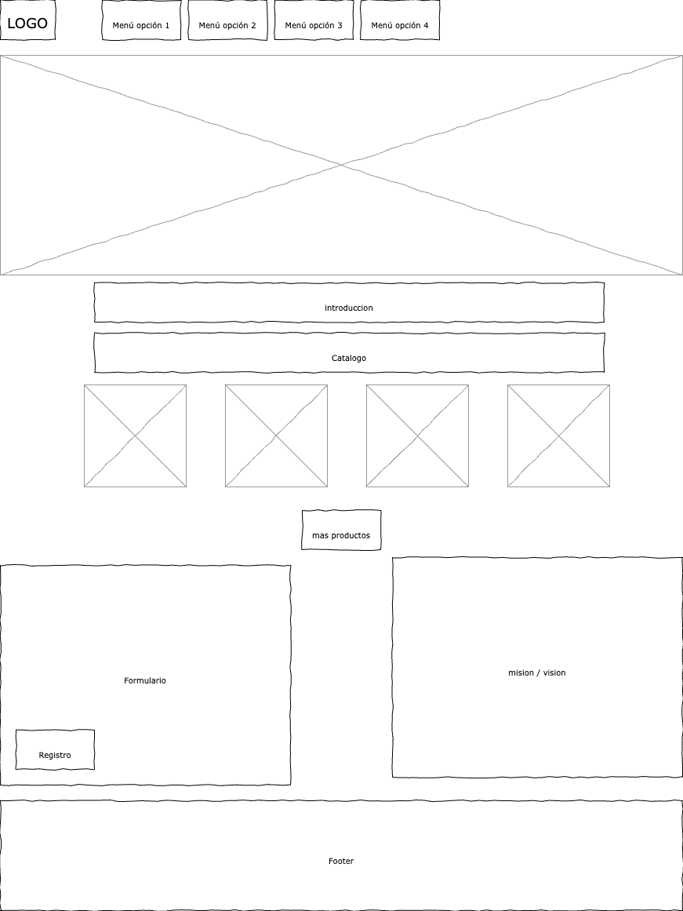
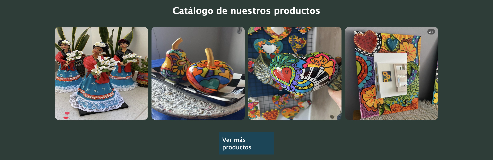
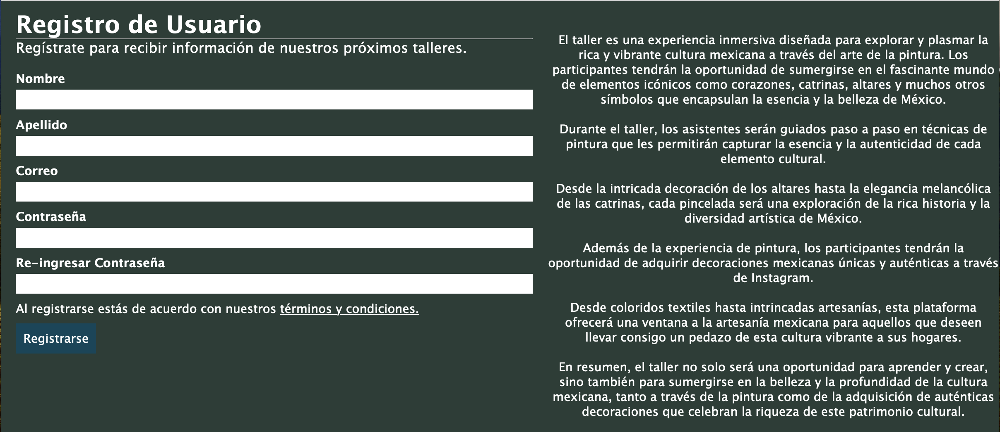

 

# Landing pagina Magenta Barrio Italia

## **ÍNDICE**

* [1. Introducción](#1-introduccion)
* [2. Implementacion](#2-implementacion)
* [3. Ejecución](#3-ejecucion)

****

## 1. Introducción

Los objetos adjuntos resuelven el enunciado que se indica a continuación:

### Enunciado ###

Este proyecto está enfocado en construir una página landing para un negocio.

Se te pide que sea una sola página que permita establecer:

Realizar un prototipado simple, en papel o utilizando un programa de dibujo, sobre cómo trabajarás tu sitio. Podrías utilizar https://draw.io si quieres evaluar una herramienta gratuita, fácil y confiable.

Muestra de los mensajes de negocio
Breve catálogo de productos
Incluir estas secciones en la interfaz:

a. Header Sección que involucra el logo y las áreas principales del sitio.

b. Main Sección de presentación del producto al usuario. Debe de incluir su título, descripción y un elemento para introducir tu correo.

c. Products Sección para mostrar los artículos del sitio web. O en su caso, artículos de catálogo de productos

d. Footer Sección que incluye todas las áreas del sitio, incluyendo redes sociales.

De manera opcional y recomendada, que la vista se adapte a 
móviles

A continuación, conoce las secciones en este dibujo, en formato de prototipado simple:

 

****

## 2. Implementacion

 

****

## 3. Ejecucion

En la siguiente imagen se muestra la ejecución 

****

